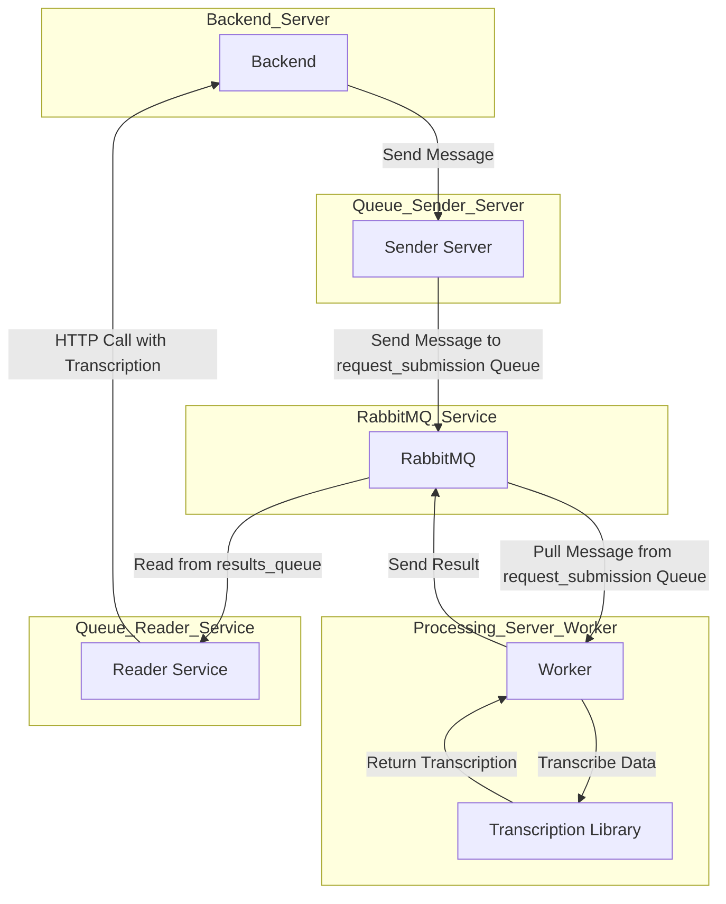

```mermaid
graph TD;
subgraph Backend_Server
A[Backend ]
end
subgraph Queue_Sender_Server
B[Sender Server]
end
subgraph RabbitMQ_Service
C[RabbitMQ]
end
subgraph Processing_Server_Worker
D[Worker]
E[Transcription Library]
end
subgraph Queue_Reader_Service
F[Reader Service]
end
A -->|Send Message| B
B -->|Send Message to request_submission Queue| C
C -->|Pull Message from request_submission Queue| D
D -->|Transcribe Data| E
E -->|Return Transcription| D
D -->|Send Result| C
C -->|Read from results_queue| F
F -->|HTTP Call with Transcription| A

```
