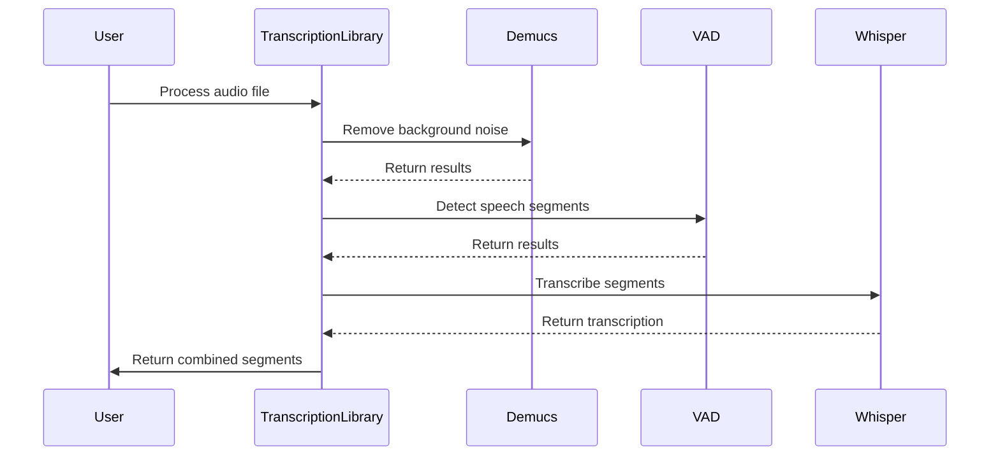

```mermaid
sequenceDiagram
    participant User
    participant TranscriptionLibrary
    User ->> TranscriptionLibrary: Process audio file
    TranscriptionLibrary ->> Demucs: Remove background noise
    Demucs -->> TranscriptionLibrary: Return results
    TranscriptionLibrary ->> VAD: Detect speech segments
    VAD -->> TranscriptionLibrary: Return results
    TranscriptionLibrary ->> Whisper: Transcribe segments
    Whisper -->> TranscriptionLibrary: Return transcription
    TranscriptionLibrary ->> User: Return combined segments
```
